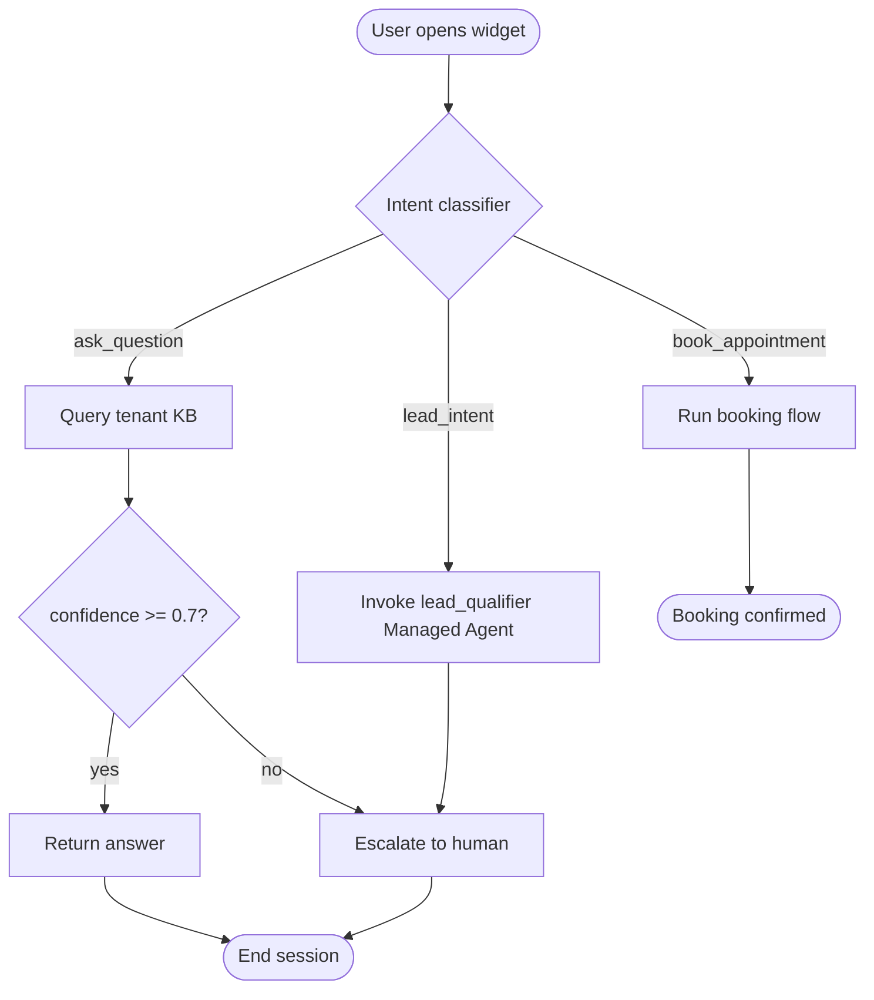

# Flowchart Decision Builder — Process → Diagram

Turn textual descriptions of branching logic into mermaid syntax (primary) or excalidraw JSON (secondary). For documenting AgentNexLiFy flows that change often enough to need text-based source of truth.

## When to Use
- Documenting widget conversation trees (intent branches, disambiguation, fallback to human)
- Mapping `backend/services/automation/scheduled_jobs.py` DAGs
- Illustrating `compound-engineering` 5-agent pipeline
- Explaining billing state machines (trial → active → past_due → canceled)
- ADRs where a picture clarifies a decision tree
- PRD appendices (`specs/<feature>_spec.md`) showing user flow

## When NOT to Use
- Static architecture diagrams (use excalidraw directly, commit .excalidraw file)
- One-off explanations in chat (just describe in prose)
- Anything requiring pixel-perfect layout (mermaid auto-layout is the point)
- Sequence diagrams (use mermaid `sequenceDiagram` directly, skip this skill)

## Output Format (mermaid primary)

## Workflow

### Step 1: Identify Nodes
Read input description. Extract:
- Entry points (rounded: `([...])`)
- Decisions (diamond: `{...}`)
- Actions (rectangle: `[...]`)
- Terminals (rounded: `([...])`)

### Step 2: Identify Edges
- Unconditional → `A --> B`
- Conditional → `A -->|label| B`
- Error path → `A -.->|error| ErrorHandler`

### Step 3: Choose Direction
- `TD` (top-down) — default, best for decision trees
- `LR` (left-right) — best for linear pipelines
- `BT` — rare, inverted tree

### Step 4: Keep Under 20 Nodes
Larger than 20 → auto-layout becomes spaghetti. Split into sub-flowcharts, link with "See also: <name>" labels.

### Step 5: Render + Ship
- Paste mermaid block into markdown (GitHub + most docs sites render natively)
- For ADRs: `/audits/` or `/planning/decisions/YYYY-MM-DD-title.md`
- For specs: `specs/<feature>_spec.md` appendix
- For PRs: drop in description; GitHub renders inline

## Style Rules
- Node labels <30 chars — longer → break into multi-line with ` `
- Decision labels on edges, not nodes
- One happy path + explicit error paths
- Consistent capitalization (sentence case inside nodes)
- No emoji (mermaid renders inconsistently across platforms)

## Excalidraw Fallback
When mermaid can't express it (custom shapes, visual grouping, freeform layout):
- Output excalidraw JSON structure
- Or describe layout in prose → user draws manually
- Save to `docs/diagrams/<name>.excalidraw`

## Anti-patterns
- Never generate a diagram for linear 3-step flow — prose wins
- Never skip decision labels (`-->|yes|`, `-->|no|`) — reader can't infer
- Never mix flowchart + sequence + class in one diagram
- Never render diagram inline in a code file (only docs)
- Never diagram flows that change weekly — stale diagram worse than none

## Cross-refs
- `.claude/skills/compound-engineering/SKILL.md` — candidate for diagram
- `.claude/skills/write-prd/SKILL.md` — append diagrams to PRDs
- `backend/services/automation/scheduled_jobs.py` — DAGs worth diagramming
- `widget/agentnexlify-widget.js` — conversation flow
- Mermaid docs: https://mermaid.js.org/syntax/flowchart.html
