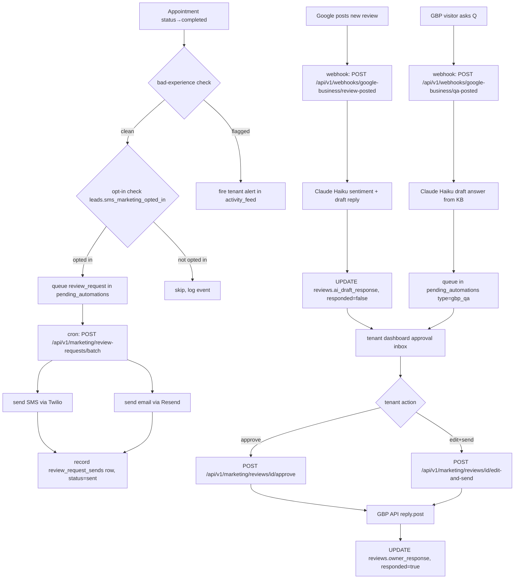
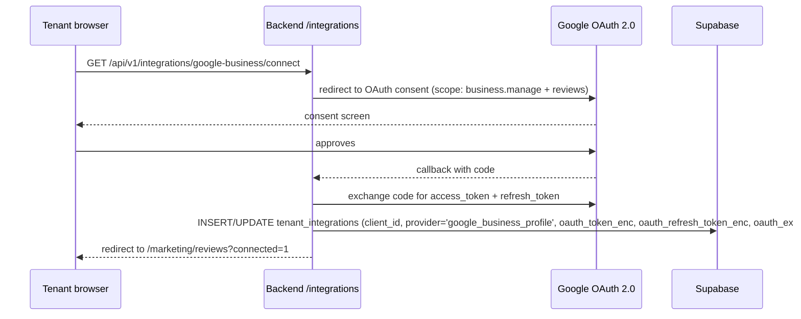

# Feature: Marketing Automation — Phase 3d

**Status:** Draft (schema-corrected 2026-04-21)
**Author:** Aidan
**Date:** 2026-04-21
**Phase:** 3d (parallel with ops-automation-surfacing)
**Positioning:** "AI employee for small trades — works while you're on the job site"
**Target tier:** `marketing_addon_active = true` (see §14.2)
**Target vertical:** 1-20 person owner-operated trades (plumbing, HVAC, cleaning, power-washing, landscaping, electrical)
**Ship bar:** ≥50% of completed appointments generate an auto-review-request within 24 hours

---

## 1. Problem Statement

Small trades operators compete on reputation, not on ad spend. A 5-star Google review is worth $200-500 in lifetime referral value. But the moment a job ends, the owner is already at the next call — no time to text the customer, check Google, or reply to a review posted three weeks ago.

The audit at `audits/audit-onboarding-2026-04-21.md` surfaced the same root problem across agents, KB, and integrations: **backend capability exists, frontend exposure and automation do not**. Marketing automation is the same pattern — the infrastructure to send SMS (Twilio), email (Resend), and call Claude (LLM runtime) is live. What is missing is the orchestration layer that fires while the owner is on a ladder.

This PRD defines that orchestration layer for marketing: review request outreach, Google review reply automation, and Google Business Profile Q&A answering.

---

## 2. Goals / Non-Goals

### Goals

- Auto-send a review-request SMS and/or email 24 hours after `appointment.status = 'completed'`, gated on opt-in + bad-experience detection
- Draft Google review replies using Claude, surfaced in a tenant approval inbox; one-click approve sends via GBP API
- Draft GBP Q&A answers from tenant KB when a visitor asks a question on Google; routes to approval inbox
- Surface marketing performance (requests sent, reviews received, average rating delta, replies posted) on the dashboard
- Comply with TCPA (SMS opt-in), CAN-SPAM (email unsubscribe), and Google ToS (GBP verification required)
- Reuse `activity_feed_service`, `automation_config` JSONB shape, and `pending_automations` table from `specs/ops-automation-surfacing_spec.md`

### Non-Goals (V1)

- Paid ad auto-management (Google Ads, Facebook Ads)
- SEO auto-optimization
- Social paid boosts
- Direct mail / postcard campaigns
- Seasonal SMS campaigns to past customers (V2)
- Referral ask after 5-star review (V2)
- Unresponsive-quote nudge at 7/14/30 days (V2)
- Stale-lead re-engagement at 90+ days (V2)
- Auto-draft case study from completed job (V2)
- Auto-post before/after job photos to Google Business or social (V2)
- Yelp review reply (V2 — same pattern as GBP, different OAuth)

---

## 3. User Stories

### Tenant (trades owner)

1. As a plumber who finishes a job at 4 PM and starts the next at 7 AM, I want the system to automatically ask my customer for a review so I capture the 24-hour satisfaction window without picking up my phone.
2. As an HVAC owner, I want to see pending Google review replies in my dashboard so I can approve them during my lunch break in 30 seconds, not draft them from scratch.
3. As a cleaning company owner, I want to know which customers opted in to SMS marketing so I'm not accidentally texting people who said no.
4. As a landscaping owner, I want bad-experience jobs skipped automatically so I'm never auto-asking for a review after a job that went sideways.
5. As a power-washing owner, I want to see a chart showing that my average Google rating went from 4.2 to 4.8 after enabling review requests.

### Customer (end consumer)

6. As a customer who had a great job done, I want a single SMS or email 24 hours later with a direct link to leave a Google review, not a general "please review us" message.
7. As a customer who opted out of SMS marketing during booking, I want to never receive a review-request SMS.
8. As a customer who posted a negative review, I want to see the business respond professionally — not defensively.

### Developer

9. As a backend developer, I want the review-request cron to reuse `pending_automations` (from ops-automation PRD) for retry logic, not build a separate queue.
10. As a backend developer, I want `automation_config` JSONB to extend the existing shape (defined in ops-automation PRD) so there is one config object per tenant, not two.
11. As a backend developer, I want `activity_feed.record_event()` (from ops-automation PRD) called for every marketing event so tenant activity logs are unified.

### Compliance Officer

12. As a compliance officer, I want every SMS marketing send to have a verifiable opt-in record with timestamp, source, IP, and user-agent stored on the lead record before the message fires.
13. As a compliance officer, I want every marketing email to include a 1-click unsubscribe link and the unsubscribe to be honored within 10 business days per CAN-SPAM.
14. As a compliance officer, I want opt-in records retained for 7 years and deletable on customer request (GDPR-friendly).

---

## 4. Success Metrics

| Metric | Baseline | Target | Measurement |
|--------|----------|--------|-------------|
| Review-request send rate | 0% | ≥50% of completed appts within 24 hr | `review_request_sends` rows / `appointments` rows with `status='completed'` in 30-day window |
| Review conversion rate | ~2% (industry avg for no ask) | ≥12% (industry avg with SMS ask) | Sends with confirmed review / total sends |
| Average rating delta | Baseline at rollout | +0.3 stars in 60 days | `reviews.rating` avg before vs after feature flag enabled |
| Approval queue time | N/A | ≤12 hr median tenant review of pending reply | `reviews.updated_at - created_at` where `responded` flips to true |
| TCPA opt-in rate | 0% (no ask exists today) | ≥30% of booking widget completions | `leads.sms_marketing_opted_in = true` / `appointments` completed |

---

## 5. Constraints

- `client_id` not `tenant_id` on all new tables — CLAUDE.md Rule 1
- `status` not `stage` or `lead_stage` — CLAUDE.md Rule 2
- Widget JS byte-identical in `widget/` and `frontend/public/widget/` if opt-in checkbox added
- No `from __future__ import annotations` in any FastAPI file
- Plan names: free, growth, professional, autopilot, enterprise — never foundation/operations
- TCPA: explicit opt-in before any SMS marketing send, no exceptions
- CAN-SPAM: 1-click unsubscribe in every marketing email; honor within 10 business days
- Google GBP API: verify OAuth scope before enabling auto-reply; 10 replies/day/tenant hard cap
- OAuth tokens encrypted at rest using existing `pgcrypto` pattern
- Review text retained max 90 days (auto-purge); opt-in records retained 7 years minimum
- All marketing events recorded via `activity_feed.record_event()` — no separate logging path
- Retry logic for failed sends reuses `pending_automations` table from ops-automation PRD
- All marketing features gated on `tenants.marketing_addon_active = true` — not plan tier

---

## 6. Architecture

### 6.1 System Overview



### 6.2 OAuth Flow — Google Business Profile



`tenant_integrations` already exists (migration 109). The current `provider` CHECK constraint covers `('drive','dropbox','onedrive','box')`. Migration 111 must ALTER the constraint to add `'google_business_profile'`.

Token refresh: nightly cron checks `oauth_expires_at`, refreshes 24hr before expiry. Failure surfaced in `activity_feed` and integration health dashboard (see ops-automation PRD).

### 6.3 Sentiment Detection Pipeline

Bad-experience detection runs before any review-request fires. Pipeline:

1. Load conversation rows for the `lead_id` linked to the appointment
2. Call `claude-haiku-4-5-20251001` with ≤10 most recent messages: "Rate the customer's sentiment in this conversation on a scale of 1-5 (1=very negative, 5=very positive). Return JSON: `{score: int, flag: bool}`"
3. Also check: `appointment.status in ('no_show', 'cancelled')` → auto-flag
4. Also check: `appointment.notes ILIKE '%issue%' OR '%problem%' OR '%complaint%'` (tenant manual flag)
5. If `flag=true` OR `score ≤ 2`: skip auto-request, route to `activity_feed` as `bad_experience_flagged` event for tenant review
6. If `score ≥ 3` and `flag=false`: proceed to opt-in check

Cost: ~300 tokens Haiku per appointment. At $0.80/MTok input, ~$0.0002 per check. Negligible at SMB scale.

---

## 7. Data Model

**Principle: EXTEND existing schema. Do NOT invent tables already present.**

### 7.1 Existing Tables — No New Tables Needed For Core Flows

#### `reviews` (migration 019) — use as-is for review reply drafting + approval

The `reviews` table already has everything needed for the review-reply inbox:

```
reviews.ai_draft_response TEXT   -- LLM writes here
reviews.owner_response TEXT      -- tenant-approved final text
reviews.responded BOOLEAN        -- false=pending, true=sent
reviews.external_review_id TEXT  -- Google review ID for dedup
reviews.platform TEXT            -- 'google', 'yelp', 'facebook'
reviews.author_name TEXT
reviews.rating INT (1-5)
reviews.review_text TEXT
reviews.tenant_id UUID           -- scope column (this table uses tenant_id, not client_id)
```

**Approval flow:**
1. GBP webhook fires → Haiku drafts reply → write to `reviews.ai_draft_response`, `responded=false`
2. Tenant sees row in approval inbox (`WHERE responded=false AND ai_draft_response IS NOT NULL`)
3. Tenant approves as-is → GBP API posts reply → write `reviews.owner_response = ai_draft_response`, `responded=true`
4. Tenant edits inline → GBP API posts edited text → write `reviews.owner_response = edited_text`, `responded=true`

**NO `review_replies` table.** The draft proposed it; existing schema makes it redundant.

Note: `reviews` uses `tenant_id` not `client_id` — this is an existing documented exception (same as `appointments`). Do not change.

#### `tenants.review_request_config JSONB` (migration 020) — trigger config

Shape: `{"enabled": false, "delay_hours": 24, "method": "email"}`

Marketing PRD extends this JSONB in place (migration 112). No new column. Adds `channel`, `bad_experience_skip`, `daily_sms_quota`, `review_url_override` keys via idempotent `||` merge. Existing `enabled`/`delay_hours`/`method` keys preserved.

#### `appointments.review_request_sent_at TIMESTAMPTZ` (migration 020) — dedup signal

Single boolean dedup for V1: if `review_request_sent_at IS NOT NULL`, skip this appointment. This covers the "don't send twice" requirement without a separate tracking table.

#### `tenants.google_review_link TEXT` (migration 011) — shortlink to Google review page

Review-request SMS and email reference this column. If null, skip SMS for that tenant and prompt tenant to configure it in dashboard settings.

#### `leads.unsubscribed BOOLEAN` + `leads.unsubscribed_at TIMESTAMPTZ` (migration 021) — CAN-SPAM opt-out

Email marketing respects `leads.unsubscribed = true`. No new opt-out table.

#### `email_templates` (migration 014) + `email_events` (migration 022) — email infrastructure

Review-request emails use `email_templates` (category: `'review_request'`) and track opens/clicks via `email_events`. Do not rebuild this infrastructure.

#### `tenant_integrations` (migration 109) — GBP OAuth storage

Already exists with `client_id`, `provider`, `oauth_token_enc`, `oauth_refresh_token_enc`, `oauth_expires_at`. The `provider` CHECK constraint must be extended to include `'google_business_profile'`. Migration 111 handles this.

### 7.2 New Columns — ALTER Existing Tables

#### ALTER `leads` — TCPA SMS opt-in record (migration 111)

TCPA requires a verifiable opt-in record with source, timestamp, and IP. Add directly to `leads`:

```sql
ALTER TABLE leads
  ADD COLUMN IF NOT EXISTS sms_marketing_opted_in BOOLEAN NOT NULL DEFAULT FALSE,
  ADD COLUMN IF NOT EXISTS sms_opted_in_at TIMESTAMPTZ,
  ADD COLUMN IF NOT EXISTS sms_opt_in_source TEXT,      -- 'booking_widget' | 'post_job_link' | 'manual'
  ADD COLUMN IF NOT EXISTS sms_opt_in_ip INET,
  ADD COLUMN IF NOT EXISTS sms_opt_in_user_agent TEXT;

CREATE INDEX IF NOT EXISTS idx_leads_sms_opted_in
  ON leads (sms_marketing_opted_in)
  WHERE sms_marketing_opted_in = TRUE;
```

**Why on `leads` not a separate table:** existing `leads` row is the canonical record for a customer contact. Opt-in state is a property of that contact. Separate `marketing_opt_ins` table would require JOIN on every send-gate check. Five columns on `leads` satisfies TCPA record-keeping requirements without another table.

**Retention note:** `leads` rows must be retained 7 years for TCPA defense. Do NOT cascade-delete `leads` rows that have `sms_marketing_opted_in = true` without archiving the opt-in record. Backend enforces soft-delete on any lead with an opt-in record.

#### ALTER `tenant_integrations` — extend provider constraint (migration 111)

```sql
-- Drop and recreate the provider CHECK to include GBP
ALTER TABLE tenant_integrations DROP CONSTRAINT IF EXISTS tenant_integrations_provider_check;
ALTER TABLE tenant_integrations ADD CONSTRAINT tenant_integrations_provider_check
  CHECK (provider IN ('drive','dropbox','onedrive','box','google_business_profile'));
```

#### ALTER `reviews` — location_id for future multi-location (migration 111)

`reviews.tenant_id` has no location breakdown. V1 tenants are single-location; V2 plumbing companies may have 3 GBP listings. Add nullable now to avoid a breaking migration later:

```sql
ALTER TABLE reviews
  ADD COLUMN IF NOT EXISTS location_id UUID;  -- nullable, populated when tenant has multiple locations
```

Not blocking V1. Default NULL = single-location tenant.

### 7.3 Optional Minimal Table — `review_request_sends`

V1 uses `appointments.review_request_sent_at` for dedup. If per-send channel/delivery tracking is needed before ship, promote a minimal table: `(id, client_id FK, appointment_id FK, channel, sent_at, twilio_msg_sid, delivery_status, created_at)` with RLS mirroring other marketing tables. Open Question 7 tracks this decision.

### 7.4 `widget_configs.automation_config` JSONB — marketing keys

The ops-automation PRD defines the `automation_config` column. Marketing adds keys to the same JSONB object:

```jsonb
{
  "review_request": {
    "mode": "silent_undo",
    "enabled": true,
    "bad_experience_skip": true,
    "daily_sms_quota": 50,
    "review_url_override": null
  },
  "review_reply": {
    "mode": "always_ask",
    "enabled": true,
    "style_tone": "friendly_professional"
  },
  "gbp_qa_answer": {
    "mode": "always_ask",
    "enabled": false
  }
}
```

`mode` values:
- `"silent_undo"` — fires automatically; tenant sees it in activity feed and has a 30-minute undo window
- `"always_ask"` — drafts and waits in approval inbox; nothing fires until tenant approves
- `"disabled"` — feature off regardless of `enabled` flag

Review request channel and delay are driven by `tenants.review_request_config` JSONB (existing column, migration 020), not duplicated here.

### 7.5 Migration Numbers

Highest existing migration: `110`. Next available: `111`. The task brief reserved 114 for ops-auto and 115 for marketing assuming parallel work on migrations 111-113. Coordinate at implementation time.

| Migration | Contents |
|-----------|----------|
| `111_marketing_schema_alters.sql` | ALTER leads ADD sms_marketing_opted_in + 4 opt-in cols + index; ALTER tenant_integrations extend provider CHECK; ALTER reviews ADD location_id NULLABLE |
| `112_marketing_review_request_config_extend.sql` | Backfill tenants.review_request_config JSONB with channel/bad_experience_skip/daily_sms_quota keys |
| `113_marketing_automation_config_defaults.sql` | Backfill widget_configs.automation_config with review_request/review_reply/gbp_qa_answer keys (IF EXISTS guard) |

Note: migrations 111-113 can ship independently of ops-automation PRD migrations. Migration 113 depends on `widget_configs.automation_config` column existing (from ops-automation PRD) — use `IF EXISTS` guard.

If ops-auto ships first and claims 111-113, renumber this PRD's migrations accordingly. Coordinate before implementation starts.

---

## 8. API Surface

### 8.1 Endpoints

#### `POST /api/v1/marketing/review-requests/batch`

Nightly cron trigger. Scans completed appointments from the last 24-72 hours (window accounts for retries), checks opt-in, runs bad-experience detection, queues sends.

**Auth:** Internal API key (cron secret), not tenant JWT.

**Request:** `{}`  (no body; cron fires without payload)

**Response:**
```json
{
  "scanned": 142,
  "queued": 67,
  "skipped_no_optin": 31,
  "skipped_bad_experience": 8,
  "skipped_already_sent": 36
}
```

**Logic:**
1. `SELECT * FROM appointments WHERE status='completed' AND completed_at BETWEEN now()-interval'72h' AND now()-interval'22h'` (22h floor avoids re-scan; 72h ceiling handles retry backlog)
2. Filter: `review_request_sent_at IS NULL` (dedup via existing column)
3. Join `tenants` — filter `marketing_addon_active = true` AND `review_request_config->>'enabled' = 'true'`
4. Join `leads` — filter `sms_marketing_opted_in = true` OR (email path: `unsubscribed = false`)
5. Check `tenants.google_review_link` — if null, skip SMS path, log `skipped_no_place_id`
6. Run bad-experience detection (Haiku sentiment + status + notes check)
7. On flag: set `appointments.review_request_sent_at = now()`, insert skipped event in `activity_feed`
8. On clean: insert into `pending_automations` (ops-automation PRD table) with `type='review_request'`
9. Cron respects `review_request_config->>'daily_sms_quota'` per tenant

#### `POST /api/v1/marketing/review-requests/send` (internal, called by pending_automations processor)

Sends the actual SMS/email for a single review request.

**Request:**
```json
{
  "appointment_id": "uuid",
  "client_id": "uuid"
}
```

**Response:** `{"sent": true, "channel": "sms"}` or error.

**Logic:**
- Load appointment + lead + tenant brand from `widget_configs`
- Build review URL from `tenants.google_review_link`
- SMS via Twilio: "Hi {first_name}, thanks for choosing {biz_name}! We'd love a quick review: {url} — reply STOP to opt out"
- Email via Resend: template from `email_templates` (category: `'review_request'`), unsubscribe link in footer
- Set `appointments.review_request_sent_at = now()`
- Call `activity_feed.record_event(client_id, 'review_request_sent', {appointment_id, channel})`

#### `GET /api/v1/marketing/reviews/pending-reply`

Returns reviews awaiting tenant approval. Queries `reviews WHERE responded=false AND ai_draft_response IS NOT NULL`.

**Auth:** Tenant JWT.

**Query params:** `client_id` (resolved from JWT), `platform` (optional filter), `limit` (default 20), `offset`.

**Response:**
```json
{
  "results": [
    {
      "id": "uuid",
      "platform": "google",
      "rating": 3,
      "author_name": "Jane D.",
      "review_text": "Job was okay but a bit slow.",
      "ai_draft_response": "Hi Jane, thank you for the feedback...",
      "created_at": "2026-04-21T14:00:00Z"
    }
  ],
  "total": 5
}
```

Note: `review_text` truncated at 500 chars in response (full text in DB, 90-day purge).

#### `POST /api/v1/marketing/reviews/{id}/approve`

Fires the AI-drafted reply as-is. `id` is a `reviews.id`.

**Auth:** Tenant JWT. Row scoped to `tenant_id` from JWT.

**Request:** `{}` (no body)

**Response:** `{"sent": true, "sent_at": "..."}` or error with `{"error": "gbp_api_error", "detail": "..."}`

**Logic:**
- Load `reviews` row, verify `tenant_id` matches JWT
- Load GBP credentials from `tenant_integrations WHERE provider='google_business_profile'`
- POST reply via Google Business Profile API `accounts/{account}/locations/{location}/reviews/{review}/reply`
- `UPDATE reviews SET owner_response = ai_draft_response, responded = true, updated_at = now() WHERE id = :id`
- Call `activity_feed.record_event(tenant_id, 'review_reply_sent', {review_id: id, rating})`
- On GBP API failure: insert into `pending_automations` for retry, return 202

#### `POST /api/v1/marketing/reviews/{id}/edit-and-send`

Tenant edited the draft before sending.

**Auth:** Tenant JWT.

**Request:**
```json
{
  "edited_reply": "Hi Jane, we appreciate the honest feedback..."
}
```

**Response:** Same as approve endpoint.

**Logic:** Same as approve but uses `edited_reply` text. `UPDATE reviews SET owner_response = :edited_reply, responded = true`.

#### `POST /api/v1/webhooks/google-business/review-posted`

Inbound webhook from GBP subscription when a new review is posted.

**Auth:** Webhook secret validation (HMAC-SHA256 header, same pattern as `stripe_webhooks.py`).

**Logic:**
1. Parse `review_id`, `rating`, `comment`, `reviewer_display_name`, `location_id`
2. Resolve `tenant_id` from `location_id` via `tenant_integrations` lookup
3. Check `reviews` for existing row with `external_review_id = review_id` — idempotent upsert
4. Check `tenant_integrations` + `automation_config.review_reply.enabled` for this tenant
5. If `mode='always_ask'`: call Claude Haiku to draft reply, `UPDATE reviews SET ai_draft_response = :draft WHERE id = :id`
6. Call `activity_feed.record_event(tenant_id, 'review_received', {rating, platform: 'google'})`
7. Return 200 immediately; all processing async via background task

#### `GET /api/v1/marketing/performance`

Marketing performance stats for dashboard card and performance page.

**Auth:** Tenant JWT.

**Query params:** `client_id` (from JWT), `since` (ISO datetime, default 30 days ago), `until` (default now).

**Response:**
```json
{
  "review_requests": {
    "sent": 47,
    "opened": 31,
    "reviewed": 14,
    "conversion_rate": 0.298
  },
  "reviews": {
    "received": 14,
    "avg_rating": 4.71,
    "replies_sent": 9,
    "replies_pending": 3
  },
  "period": {
    "since": "2026-03-22T00:00:00Z",
    "until": "2026-04-21T00:00:00Z"
  }
}
```

`reviews_pending` = `COUNT(*) FROM reviews WHERE responded=false AND ai_draft_response IS NOT NULL AND tenant_id=:tid`

### 8.2 Pydantic Models

`backend/models/marketing.py`:

```python
class ReviewReplyTone(str, Enum):
    friendly_professional = "friendly_professional"
    professional = "professional"
    apologetic = "apologetic"

class ReviewPendingReplyResponse(BaseModel):
    id: UUID
    platform: str
    rating: int | None
    author_name: str | None
    review_text: str | None   # truncated 500 chars
    ai_draft_response: str | None
    created_at: datetime

class EditAndSendRequest(BaseModel):
    edited_reply: str

class MarketingPerformanceResponse(BaseModel):
    review_requests: dict
    reviews: dict
    period: dict
```

Note: `tone` field removed from `ReviewPendingReplyResponse` — tone is a prompt-time concept, not stored on `reviews` table. If V2 needs it, add a `reply_tone` column via migration.

---

## 9. Technical Implementation

### 9.1 Backend Files

#### New files

| File | Purpose |
|------|---------|
| `backend/services/marketing/review_request_service.py` | Bad-experience detection, opt-in check, batch scan logic, SMS/email dispatch |
| `backend/services/marketing/review_reply_service.py` | GBP API wrapper, Claude draft generation, reply approval flow |
| `backend/services/marketing/gbp_client.py` | Google Business Profile API client (OAuth token refresh, rate limit tracking) |
| `backend/services/marketing/sentiment_detector.py` | Haiku sentiment pipeline for bad-experience flagging |
| `backend/routers/marketing.py` | All marketing endpoints registered here |
| `backend/models/marketing.py` | Pydantic request/response models |
| `backend/services/marketing/__init__.py` | Package init |

#### Files to modify

| File | Change |
|------|--------|
| `backend/main.py` | Register `marketing` router (lines 746-813 per CLAUDE.md onboarding) |
| `backend/routers/integrations.py` | Add GBP OAuth connect/callback routes reusing existing OAuth pattern from Google Calendar |
| `backend/services/automation/scheduled_jobs.py` | Add nightly review-request batch job + token refresh job |
| `widget/agentnexlify-widget.js` | Add opt-in checkbox to booking confirmation step |
| `frontend/public/widget/agentnexlify-widget.js` | Byte-identical copy of widget change |

#### Router registration in `main.py`

```python
from backend.routers import marketing
app.include_router(marketing.router, prefix="/api/v1/marketing", tags=["marketing"])
```

Webhook routes registered separately:
```python
app.include_router(marketing.webhook_router, prefix="/api/v1/webhooks", tags=["webhooks"])
```

### 9.2 Frontend Files

| File | Purpose |
|------|---------|
| `frontend/src/pages/MarketingReviews.jsx` | Approval inbox — review list + approve/edit/skip actions |
| `frontend/src/pages/MarketingPerformance.jsx` | Chart of review count + avg rating over time (Recharts) |
| `frontend/src/components/marketing/ReviewReplyCard.jsx` | Single review row with AI draft, tone selector, action buttons |
| `frontend/src/components/marketing/ReviewRequestStats.jsx` | Dashboard card: "12 requests sent → 4 new 5-star reviews" |
| `frontend/src/utils/api/marketing.js` | API calls for all marketing endpoints |

#### Dashboard integration

`frontend/src/pages/Dashboard/index.jsx` or equivalent: add `ReviewRequestStats` card to dashboard grid. Position below leads card, above automation status.

#### Sidebar entry

Add to `frontend/src/components/Sidebar.jsx`:
```
Marketing
  ├── Reviews (pending badge count)
  └── Performance
```

#### App routing

Add to `frontend/src/App.jsx`:
```
/marketing/reviews   → MarketingReviews
/marketing/performance → MarketingPerformance
```

### 9.3 Widget Opt-In Checkbox

Booking confirmation step in widget adds:

```html
<label class="anx-optin-label">
  <input type="checkbox" name="sms_optin" id="anx-sms-optin" />
  <span>Text me review requests and job updates (opt out anytime, reply STOP)</span>
</label>
```

Checkbox MUST be unchecked by default. Pre-checked boxes do not constitute valid TCPA consent.

On booking submit, widget POSTs `sms_opted_in: bool` alongside appointment data. Backend writes to `leads.sms_marketing_opted_in`, `leads.sms_opted_in_at`, `leads.sms_opt_in_source`, `leads.sms_opt_in_ip`, `leads.sms_opt_in_user_agent`.

Byte-identical rule: edit `widget/agentnexlify-widget.js` first, then copy to `frontend/public/widget/agentnexlify-widget.js`. Use `.claude/skills/widget-test/SKILL.md` for cross-origin embed verification after change.

---

## 10. Compliance Deep-Dive

### 10.1 TCPA (Telephone Consumer Protection Act)

**What it governs:** Automated SMS to US consumers. Violations: $500-$1,500 per message. Class action exposure is significant for platforms.

**Requirements met by this PRD:**

**Prior express written consent:** Required before any marketing SMS. AgentNexLiFy captures consent at:
1. Booking widget checkbox: "Text me review requests and job updates (opt out anytime, reply STOP)" — checkbox must be unchecked by default. Pre-checked boxes do not constitute valid consent under TCPA.
2. Post-job confirmation link: opt-in URL sent via booking confirmation email (transactional, exempt) containing a landing page with TCPA-compliant consent language.

**Consent record requirements:**
- `leads.sms_opt_in_ip INET` stores the IP address at consent time
- `leads.sms_opt_in_user_agent TEXT` stores the user agent at consent time
- `leads.sms_opted_in_at TIMESTAMPTZ` stores the exact timestamp
- `leads.sms_opt_in_source TEXT` stores the capture method (`'booking_widget'` | `'post_job_link'` | `'manual'`)
- These records must be producible in litigation. Retain 7 years minimum. `leads` rows with `sms_marketing_opted_in = true` must never be hard-deleted without archiving opt-in columns.

**Opt-out honoring:**
- SMS reply "STOP" → Twilio webhook fires → `leads.sms_marketing_opted_in = false`, `leads.unsubscribed_at = now()`
- All subsequent SMS to that phone number blocked at `review_request_service.py` before dispatch
- Honor within the same business day; Twilio auto-honors STOP at carrier level, but the DB must also update

**Exemptions NOT applicable here (do not conflate):**
- Missed-call text-back (appointment reminder from inbound customer call) is transactional/informational — TCPA marketing consent NOT required. `review_request_service.py` must explicitly gate on `leads.sms_marketing_opted_in = true` only for the marketing-category sends defined in this PRD.
- Appointment reminders sent to customers who booked are transactional — consent not required. Keep separate from marketing sends.

**Established business relationship (EBR):** EBR does NOT exempt automated marketing SMS under TCPA. The EBR exception applies to calls, not texts. Do not rely on it.

**Recommended legal coverage:** Surface opt-in language to tenant onboarding with: "By enabling SMS marketing, you confirm your customers have opted in. AgentNexLiFy is the technology platform; you are the sender."

### 10.2 CAN-SPAM (email marketing)

**Requirements met:**

**Physical address:** Every marketing email from AgentNexLiFy on behalf of tenant includes tenant's business address (captured during onboarding, required field before marketing email enabled). The "From" address reflects the tenant business, not `@agentnexlify.com`.

**Honest subject lines:** Review-request emails use: "How was your service with {biz_name}?" — honest, not deceptive.

**Opt-out mechanism:** Every marketing email includes a 1-click unsubscribe link via Resend's built-in unsubscribe header + a visible footer link. Both must work. Resend's unsubscribe webhook fires → backend updates `leads.unsubscribed = true`, `leads.unsubscribed_at = now()`.

**10-business-day honor window:** Unsubscribe processed same-day via webhook. 10 business days is the maximum; immediate is the implementation target.

**Commercial email identification:** Review-request emails are commercial (soliciting a commercial benefit). The footer must include: "This is a marketing email from {biz_name}. You're receiving this because you requested service."

**No deceptive routing:** "From" domain must be verified in Resend (SPF/DKIM/DMARC). Do not send from unverified domains.

### 10.3 Google Business Profile Terms of Service

**Fake reviews prohibition (§4.4):** Tenants may not review their own business or ask employees to. AgentNexLiFy's review-request flow sends to customers who completed jobs — this is compliant solicitation. Do not send to contacts who haven't had a job completed.

**Reply content policy:** Auto-replies must not contain: offers of compensation for removing a review, threats, PII, or off-topic promotional content. The Claude reply prompt must enforce this explicitly (see §9, Claude prompt design).

**GBP API quota limits:** Google enforces per-location limits on the `reviews.reply` endpoint. Our 10 replies/day/tenant cap is conservative. If a tenant has multiple locations, cap applies per location ID, not per `tenant_id`. `gbp_client.py` must track per-location-ID quota in Redis or via `reviews` count query.

**OAuth scope required:** `https://www.googleapis.com/auth/business.manage` — full GBP management. Smaller read-only scopes are insufficient for posting replies.

**GBP verification:** Google requires the business listing to be verified before the API can post replies. `gbp_client.py` must check `verificationState` on location fetch. If not verified: return 422 to frontend with a "verify your listing at business.google.com" CTA. Do not surface this as a generic error.

### 10.4 GDPR / Data Protection (EU/UK tenants)

AgentNexLiFy's current tenants are US-based trades. However:

**Customer data residency:** Review text and customer names sourced from Google are not stored longer than 90 days. `reviews.review_text` is purged nightly for rows older than 90 days. Purge job runs in `scheduled_jobs.py`.

**Right to erasure (Article 17 GDPR):** A customer can request deletion of their opt-in record. Backend provides `DELETE /api/v1/marketing/opt-ins/by-contact` endpoint (tenant-callable, not publicly exposed). Sets `leads.sms_marketing_opted_in = false`, nulls `sms_opted_in_at`, `sms_opt_in_source`, `sms_opt_in_ip`, `sms_opt_in_user_agent`. **Exception:** Opt-in records needed for litigation defense may be retained under "legal claims" exemption — log the deletion request and retain a tombstone row with PII stripped.

**Data minimization:** Opt-in record stores only what is needed: consent boolean, timestamp, source, IP, UA. No address, no payment data, no chat history in these columns.

**US tenants note:** GDPR is not applicable to US-only tenant/customer relationships. Implement GDPR-friendly deletion anyway — it costs nothing and positions the platform for EU expansion.

---

## 11. Edge Cases and Failure Modes

### 11.1 Bad-Experience Detection

| Scenario | System behavior |
|----------|----------------|
| `appointment.status = 'no_show'` | Auto-skip. Set `appointments.review_request_sent_at = now()` (marks as handled). Fire `bad_experience_flagged` in activity_feed. |
| `appointment.status = 'cancelled'` | Same as no_show. |
| Haiku sentiment returns `score ≤ 2` | Skip review request. Mark appointment as handled. Fire activity_feed event with `score` in metadata for tenant visibility. |
| Haiku API call fails | Default to `score=3` (neutral). Log warning. Do NOT skip by default — missing Haiku call should not block legitimate review requests. Alert on repeated Haiku failures. |
| Tenant manually set notes containing "issue", "complaint", "problem", "not happy", "refund" | Flag as bad_experience. Set handled. Alert tenant in activity_feed. |
| Customer had prior 1-star review on record | Surface in activity_feed but do NOT auto-skip — tenant may still want to ask for a second chance. Configuration option in V2. |

### 11.2 Google API Failures

| Scenario | System behavior |
|----------|----------------|
| GBP API returns 429 (quota exceeded) | Insert into `pending_automations` with `retry_after = now() + interval '6h'`. Never retry more than 3 times. On third failure, update `reviews.responded = false` (leave in inbox), surface in tenant dashboard with error state. |
| GBP API returns 401 (token expired) | Trigger token refresh via `gbp_client.py`. If refresh fails, update `tenant_integrations.last_sync_status='error'`, fire `integration_disconnected` event in activity_feed. Gray out review-reply feature with reconnect CTA. |
| GBP API schema change breaks response parsing | Fallback: log raw response, leave `reviews.responded = false` (stays in inbox), surface to tenant with raw response excerpt. Do NOT silently swallow. Alert via Sentry. |
| Google location not verified | Return 422 to tenant with exact message: "Your Google Business listing must be verified before replies can be posted. Visit business.google.com to verify." Do not allow `approve` endpoint to proceed. |

### 11.3 SMS / Email Failures

| Scenario | System behavior |
|----------|----------------|
| Twilio returns invalid number error | Leave `appointments.review_request_sent_at = NULL` so retry is possible. Attempt email fallback if `leads.unsubscribed = false`. Log event. |
| SMS bounces (carrier unreachable) | Twilio webhook fires `undelivered` status. Attempt email fallback. |
| Email bounce (hard bounce) | Resend webhook fires. Update `leads.unsubscribed = true`, `leads.unsubscribed_at = now()`. Do not retry. Surface bounce rate on performance page. |
| Email bounce (soft bounce) | Retry once in 6h. After second failure, treat as hard bounce. |
| Tenant's Twilio account suspended | `pending_automations` processor receives 5xx. Mark all queued sends as failed. Fire `integration_error` in activity_feed. |

### 11.4 Opt-In Edge Cases

| Scenario | System behavior |
|----------|----------------|
| Customer books twice, checks opt-in on second booking | UPDATE `leads` — set `sms_marketing_opted_in=true`, `sms_opted_in_at=now()`. Idempotent upsert on existing lead row. |
| Customer replies STOP but later opts back in | Twilio sends new opt-in confirmation. Backend sets `leads.sms_marketing_opted_in=true`, new `sms_opted_in_at`. |
| No Google review link configured for tenant | `review_request_service.py` checks `tenants.google_review_link`. If null: skip SMS review request, log `skipped_no_place_id`. Prompt tenant in dashboard to configure their Google review link. |

---

## 12. Security

**OAuth token storage:** GBP access tokens and refresh tokens encrypted at rest via `pgp_sym_encrypt()` (pgcrypto extension, already active per migration 109). Stored in `tenant_integrations.oauth_token_enc` and `oauth_refresh_token_enc` (bytea). Same pattern as Google Calendar in `backend/services/google_calendar.py`.

**Webhook signature verification:** `POST /api/v1/webhooks/google-business/review-posted` validates `X-Goog-Signature` header using HMAC-SHA256 with the webhook secret from `settings.google_webhook_secret`. Reject without verifying. Pattern mirrors `stripe_webhooks.py`.

**Tenant isolation:** Every DB query scoped to `tenant_id` (reviews table) or `client_id` (new tables). RLS enforces at Postgres level as secondary defense. `marketing_addon_active` check on every feature entry point — not just at route registration.

**No review text in logs:** `review_text` must not appear in application logs at INFO or DEBUG level. Log only `review_id`, `rating`, `tenant_id`. Guard in `review_reply_service.py`.

**Opt-in record integrity:** `leads` rows with `sms_marketing_opted_in = true` must not be hard-deleted. Service account has UPDATE on `leads.sms_marketing_opted_in` columns. Hard deletes to `leads` require a GDPR erasure admin function that strips PII but retains opt-in tombstone.

**Rate limiting:** Review-request batch endpoint protected by cron secret header. Approval endpoints rate-limited to 60 requests/minute per tenant JWT to prevent reply spam. Implement via FastAPI `SlowAPI` middleware (already in use for widget chat).

**90-day review text purge:** Nightly scheduled job runs:
```sql
UPDATE reviews
SET review_text = '[purged]', author_name = '[purged]'
WHERE created_at < now() - interval '90 days'
  AND review_text != '[purged]';
```

---

## 13. Testing Strategy

### 13.1 Backend Unit Tests

Target: 80% coverage on new service modules. 100% on opt-in check path and bad-experience detection (compliance-critical).

| Test file | Coverage targets |
|-----------|-----------------|
| `backend/tests/test_review_request_service.py` | Batch scan logic, bad-experience detection (all 4 trigger paths), opt-in gate, SMS/email dispatch mock |
| `backend/tests/test_review_reply_service.py` | Draft generation (Haiku mock), approve flow, edit-and-send flow, GBP API mock |
| `backend/tests/test_gbp_client.py` | Token refresh, quota tracking, location verification check |
| `backend/tests/test_sentiment_detector.py` | Score→flag mapping, Haiku failure fallback (default to neutral), no_show auto-flag |
| `backend/tests/test_marketing_router.py` | Auth, tenant isolation (wrong tenant_id returns 404), response schema |

**Regression tests for compliance:**
```python
# TCPA: SMS never fires without opt-in
def test_review_request_skips_without_optin():
    # given: completed appointment, leads.sms_marketing_opted_in=False
    # when: batch runs
    # then: appointment.review_request_sent_at stays NULL, skip logged

# Sentiment gate
def test_review_request_skips_on_negative_sentiment():
    # given: completed appointment, leads.sms_marketing_opted_in=True
    # when: Haiku returns score=2
    # then: appointment.review_request_sent_at=now(), bad_experience logged

# Haiku failure fallback
def test_review_request_proceeds_on_haiku_failure():
    # given: Haiku raises APIError
    # when: batch runs
    # then: review_request queued (default neutral, warning logged)

# marketing_addon_active gate
def test_review_request_skips_when_addon_inactive():
    # given: tenant.marketing_addon_active=False
    # when: batch runs
    # then: tenant skipped entirely
```

### 13.2 Integration / E2E Tests

**Happy path:**
1. Create appointment with `status='completed'`
2. Set `leads.sms_marketing_opted_in=True`
3. Mock Haiku to return `{score: 5, flag: false}`
4. Call `POST /api/v1/marketing/review-requests/batch`
5. Assert `appointments.review_request_sent_at` is set
6. Process `pending_automations` queue
7. Mock Twilio — assert SMS sent with correct review URL from `tenants.google_review_link`
8. Mock GBP webhook POST with 5-star review
9. Assert `reviews` row updated with `ai_draft_response IS NOT NULL`, `responded=false`
10. Call `POST /api/v1/marketing/reviews/{id}/approve`
11. Mock GBP API reply endpoint — assert reply posted
12. Assert `reviews.responded=true`, `reviews.owner_response` populated

**Bad experience path:**
1. Create appointment with `status='completed'`, notes "customer complained about delay"
2. Set `leads.sms_marketing_opted_in=True`
3. Call batch
4. Assert `appointments.review_request_sent_at` is set (marks handled, not sent)
5. Assert `activity_feed` event `bad_experience_flagged` exists

### 13.3 Widget Opt-In Test

Use `.claude/skills/widget-test/SKILL.md` cross-origin embed test. Specifically:
- Opt-in checkbox renders correctly on booking step
- Unchecked by default
- `sms_opted_in=false` submitted if unchecked
- `sms_opted_in=true` submitted if checked
- `leads.sms_marketing_opted_in` updated after booking completes

---

## 14. Rollout Plan

### 14.1 Feature Flag

Gate at entry: `tenants.marketing_addon_active = true`. No separate feature flag table needed. Checked on every marketing endpoint and in the batch cron before processing any appointment.

### 14.2 Add-On Gating (Replaces Plan-Tier Gating)

**ALL marketing features gate on `tenants.marketing_addon_active = true`.** This is a $49.99/mo add-on separate from the primary plan (migration 102).

| Feature | Gate |
|---------|------|
| Review request (SMS + email) | `marketing_addon_active = true` |
| Review reply inbox | `marketing_addon_active = true` |
| GBP Q&A auto-answer | `marketing_addon_active = true` |

**NOT plan-tier based.** The draft's Growth/Professional/Enterprise matrix was incorrect. Plan tiers control ops-automation features. Marketing add-on controls all features in this PRD.

**Grandfather logic:** Existing paid tenants (growth/professional/autopilot/enterprise) had `marketing_addon_active` set to `true` with `marketing_addon_grandfathered=true` via migration 102. They retain access until the deactivation script runs (`scripts/migrations/deactivate_grandfathered_marketing.sh`). Do not re-gate grandfathered tenants during V1 rollout.

### 14.3 Rollout Sequence

| Week | Action |
|------|--------|
| 1-2 | Internal test (Aidan's test tenant). Validate SMS send, opt-in flow, approval inbox. |
| 3-4 | 2 paid testers with verified Google Business profiles. Collect real review-request conversion data. |
| 5 | TCPA audit: confirm all sends have `leads.sms_marketing_opted_in=true` records in DB. |
| 6 | Enable for all `marketing_addon_active=true` tenants. Monitor review conversion rate. |
| 8 | V2 scoping: seasonal SMS, referral ask, Yelp. |

### 14.4 Monitoring Checklist (post-launch)

- Daily: Appointments with `review_request_sent_at` set but no Twilio confirm — alert if >5%
- Daily: GBP API quota headroom per tenant
- Weekly: TCPA audit query — any sends to leads where `sms_marketing_opted_in=false`
- Weekly: opt-out spike detection — sudden spike may indicate unwanted sends
- Monthly: avg rating delta per tenant — primary success metric

---

## 15. Dependencies on ops-automation-surfacing_spec.md

This PRD has hard dependencies on infrastructure defined in `specs/ops-automation-surfacing_spec.md`. Both PRDs are written in parallel. Coordinate these shared contracts at implementation time:

| Dependency | Required from ops-automation PRD | Notes |
|------------|----------------------------------|-------|
| `activity_feed_service.py` | `record_event(client_id, event_type, metadata)` function signature | Marketing calls this for every send, receipt, skip, and error |
| `pending_automations` table | Schema: `id, client_id, type, payload, status, retry_count, retry_after, created_at` | Marketing uses `type='review_request'` and `type='gbp_reply'` and `type='gbp_qa'` |
| `automation_config` JSONB column on `widget_configs` | Column must exist before migration 113 runs | Marketing adds keys to existing JSONB object; migration 113 uses IF EXISTS guard |
| `vertical_defaults` table or equivalent | Default `automation_config` values per business_type | Marketing uses same defaults seeded by ops-automation PRD |

**Coordination rule:** If ops-automation PRD ships first, this PRD's migrations can run in sequence. If this PRD ships first, migrations 111-112 (ALTER leads, extend review_request_config) can run independently. Migration 113 (JSONB backfill on widget_configs) must wait for ops-automation migration that creates `automation_config` column — use `IF EXISTS` guard.

`tenant_integrations` already exists (migration 109) — no coordination needed for GBP OAuth storage.

---

## 16. Open Questions

| # | Question | Owner | Blocks |
|---|----------|-------|--------|
| 1 | Does tenant need to configure their Google review link manually or can we auto-resolve from GBP OAuth location list? Auto-resolve is better UX but requires additional GBP API call at connect time. | Aidan | review_request URL generation |
| 2 | GBP webhook subscription setup — does AgentNexLiFy register a webhook per-location or per-account? Per-location is simpler but requires re-registration on new location add. | Aidan | gbp_client.py webhook registration |
| 3 | Resend "from" domain — review-request emails need a verified domain. Do tenants use `@agentnexlify.com` sub-addressing or bring their own domain? | Aidan | Resend configuration |
| 4 | Yelp API access — Yelp closed their reviews API to new partners. Confirm before adding Yelp to V2 scope. | Aidan | V2 scope |
| 5 | Multi-location tenants — `reviews.location_id` added as nullable. When does V2 populate it? On GBP OAuth, should we resolve all location IDs and store them in `tenant_integrations` immediately? | Aidan | V2 multi-location design |
| 6 | ops-automation-surfacing_spec.md migration numbers — migrations 111-113 above may collide if ops-auto PRD claims the same range. Confirm before implementation starts. | Both PRDs | Migration sequencing |
| 7 | `review_request_sends` table — V1 decision deferred (use `appointments.review_request_sent_at` only). If per-send channel + delivery tracking is required before ship, promote optional table from §7.3. | Aidan | V1 scope finalization |

---

## 17. Lessons Learned

**Rule violated:** `.claude/rules/fill-instructions-before-guessing.md`

The first draft of this PRD (925 lines, 2026-04-21) invented three tables already present in production:

| Invented table | What already existed |
|----------------|---------------------|
| `review_replies` | `reviews.ai_draft_response`, `reviews.owner_response`, `reviews.responded` (migration 019) |
| `review_requests` | `appointments.review_request_sent_at` (migration 020) |
| `marketing_opt_ins` | `leads.unsubscribed`, `leads.unsubscribed_at` (migration 021) + 5 new ALTER columns |

The plan-gating section proposed Growth/Professional/Enterprise tiers. Existing reality: `tenants.marketing_addon_active` Boolean from a $49.99/mo add-on (migration 102). The tier matrix was fiction.

**Root cause:** Grill-me questions went directly to solution design without reading the migration history first. The schema was guessed, not read.

**Protocol that would have prevented this (per fill-instructions-before-guessing.md §Protocol):**
1. Before writing any table, run: `ls migrations/` + read migrations matching the feature domain
2. If a table is proposed, grep for it: `grep -rl "CREATE TABLE.*review" migrations/`
3. If a column is proposed, grep for it: `grep -rl "review_request_sent" migrations/`
4. If gating is proposed, find the gating migration: `grep -rl "marketing_addon" migrations/`

Future PRD authors: read migrations first. `ls migrations/ | wc -l` returns 113 files — all of them are ground truth. CLAUDE.md rule §schema-discipline says "verify the column exists." That rule applies to PRD drafting, not just implementation.
